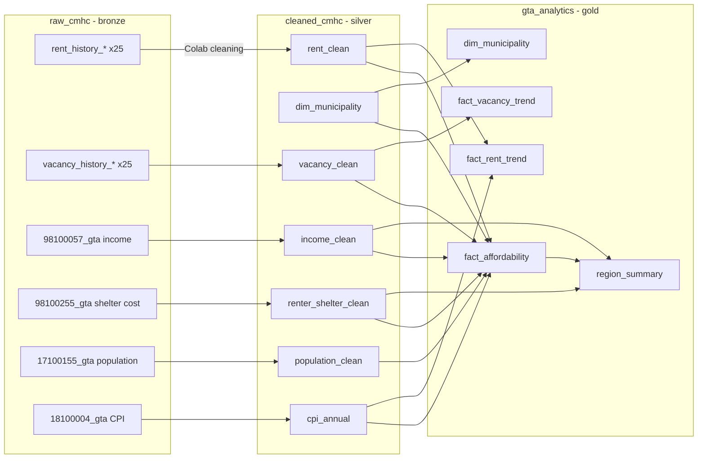

# 4 — Analysis (BigQuery SQL)

SQL that turns the raw tables into clean tables and KPI views for the Power BI dashboard, plus six business-question queries.
Everything lives in BigQuery project `gta-housing-508813`, in three layers:

| Layer | Dataset | Contents | Who reads it |
|---|---|---|---|
| Bronze (raw) | `raw_cmhc` | The 111 tables loaded by the step 2 notebook, unchanged | Only the silver SQL |
| Silver (clean) | `cleaned_cmhc` | `rent_clean` (team's Colab cleaning) + 6 clean views from this folder | Only the gold SQL |
| Gold (dashboard) | `gta_analytics` | 6 views, ready for Power BI | **Power BI** |

## How to run in BigQuery

1. **Prerequisite:** upload `3-Clean/Cleaned_Data/rent_clean.csv` as table `gta-housing-508813.cleaned_cmhc.rent_clean`.
2. In BigQuery Studio, run each file in `sql/` **in order** (01 → 20). File 01 creates the `cleaned_cmhc` and `gta_analytics` datasets if they don't exist. Files 01–13 create views; file 20 is queries only.
3. Re-running a file just replaces its view.

## For the Power BI dashboard

Connect Power BI to BigQuery (**Get data → Google BigQuery**) and load only the **`gta_analytics`** dataset:

| View | Grain | Use it for |
|---|---|---|
| `dim_municipality` | municipality (25) | Slicers (municipality, region); relationship key `csd_code` |
| `fact_affordability` | municipality (25) | KPI cards, rankings, map: rent-to-income, income needed, renter stress, vacancy, growth |
| `fact_rent_trend` | municipality × year × bedroom | Rent over time, year-over-year change, rent in 2025 dollars, index (2015 = 100) |
| `fact_vacancy_trend` | municipality × year × bedroom | Vacancy over time |
| `region_summary` | region (5) + Ontario | Region comparison |

**Relationships:** `dim_municipality[csd_code]` 1 → many `csd_code` in `fact_affordability`, `fact_rent_trend` and `fact_vacancy_trend`. `region_summary` stands alone (join on region name if needed).

**Show on the dashboard:** the caveats below, especially that rent-to-income uses all-household income (renters earn less), that 2025 income is an estimate, and that blank means "not published", not zero. `quality_flag` / `rent_2br_2025_quality` carry CMHC's reliability rating (a–d); consider greying out "d" values.

## Model



| File | Creates | Layer | What it is |
|---|---|---|---|
| `01_dim_municipality.sql` | `dim_municipality` | silver | The 25 municipalities, region, CMA. Join key `csd_code` |
| `02_vacancy_clean.sql` | `vacancy_clean` | silver | Vacancy history, same shape as `rent_clean` (the vacancy cleaning step wasn't done yet) |
| `03_income_clean.sql` | `income_clean` | silver | Median household income 2020 (and 2015 in 2020 $), municipalities + regions + Ontario + Canada |
| `04_renter_shelter_clean.sql` | `renter_shelter_clean` | silver | Renter / owner households spending 30%+ of income on shelter, 2021 |
| `05_population_clean.sql` | `population_clean` | silver | Population, 2001–2025 |
| `06_cpi_annual.sql` | `cpi_annual` | silver | Toronto CPI annual average (all-items and rent) |
| `10_fact_affordability.sql` | `fact_affordability` | gold | **Main KPI table**, all 25 rows even where data is missing |
| `11_fact_rent_trend.sql` | `fact_rent_trend` | gold | Rent with year-over-year change, 2025 dollars, index (2015 = 100) |
| `12_region_summary.sql` | `region_summary` | gold | Region roll-up plus Ontario |
| `13_gold_dimensions.sql` | `dim_municipality`, `fact_vacancy_trend` | gold | Pass-throughs so Power BI reads gold only |
| `20_business_questions.sql` | — | — | Queries answering Q1–Q6 |

## KPI definitions

| KPI | Column(s) | Definition |
|---|---|---|
| Rent-to-income | `rti_2br_2020_pct` (observed), `rti_2br_2025_est_pct` (estimate) | Average 2-bedroom rent × 12 ÷ median household income. 2020 uses same-year rent and census income. 2025 carries 2020 income forward with Toronto CPI (+19.5%), so it assumes incomes kept pace with inflation |
| Income needed | `income_needed_2br_2025`, `income_needed_pct_of_median_2025` | Income at which the average 2-bedroom costs 30% of gross income (the CMHC benchmark) |
| Renter stress | `renters_30_plus_2021_pct` | Renter households spending 30%+ of income on shelter ÷ renter households with a calculable ratio (2021 Census) |
| Vacancy | `vacancy_total_2025_pct` | CMHC October vacancy rate. About 3% is considered balanced |
| Rent vs income growth | `real_rent_2br_growth_2015_2020_pct`, `real_income_growth_2015_2020_pct` | Both in 2020 dollars. Rent adjusted with Toronto CPI; census income already in constant dollars |
| Rent growth | `rent_2br_cagr_2020_2025_pct`, `rent_2br_cagr_2015_2025_pct` | Compound annual growth of the 2-bedroom rent |

`NULL` always means "not published", never zero.

## Findings (answers to Q1–Q6)

Full outputs are in [`results/`](results/). Figures use 2-bedroom rent unless stated otherwise.

**Q1. Is renting outside Toronto more affordable once income is considered? Yes, relative to the median household.**
Toronto has the highest rent-to-income (24.6%) because its median household income is the lowest ($100k est. 2025) while its rent ($2,055) is about the same as Peel and York. Every other municipality is lower, from Newmarket (21.8%) down to Halton Hills (12.1%), Scugog (13.5%) and Whitby (13.7%).

**Q2. What income does the average 2-bedroom require?** From $51,800 (Brock) to $95,400 (Newmarket). Toronto needs $82,200, which is 82% of its median household income, the tightest ratio in the GTA. Newmarket (73%) and Oshawa (69%) are next.

**Q3. For whom? Renters, everywhere.** At the median household income every municipality looks "affordable" (under 30%). But 37–51% of renter households already spend 30% or more on shelter in every municipality except Brock (32%), in line with or above Ontario (38.4%). The worst renter stress is in affluent York and Halton suburbs: **Richmond Hill 51.2%, Vaughan 50.4%, Markham 47.8%, Oakville 45.8%**. High household medians there are driven by owners, and renters earn far less.

**Q4. Did rent outpace income (2015–2020, inflation-adjusted)?** In 12 of 19 municipalities with data, yes. The biggest gaps were Georgina (+17 pts), Oakville (+14) and Newmarket (+12). In Toronto, Brampton and Milton, income grew faster, but 2020 incomes were lifted by pandemic benefits (CERB), so this flatters income.

**Q5. How fast are rents rising now?** From 2020 to 2025, 2-bedroom rents rose 2.7–9.3% a year against 3.6% a year inflation, and 15 of 17 municipalities beat inflation. Newmarket is the outlier: $1,527 → $2,384, +9.3% a year. Aurora (+7.2%) and Scugog (+6.4%) are next.

**Q6. How much choice do renters have?** 8 of the 13 municipalities with a 2025 vacancy rate are below 3%, including Toronto (2.8%). Brampton (4.3%), Oshawa (4.0%) and Mississauga (3.8%) have the most choice. Brock's 0.0% has a "d" quality rating, so use it with caution.

**By region:** Durham has the lowest rents ($1,737 weighted average) and Toronto the highest rent-to-income. York has the highest renter stress (47.2%), and only 4 of its 9 municipalities have a published rent.

## Caveats

- **Median household income covers owners and renters.** Renters earn less, so the rent-to-income ratios understate the burden on renters. `renters_30_plus_2021_pct` is the renter-specific measure. StatCan doesn't publish renter-only median income by municipality.
- **2025 income is an estimate** (2020 census income × CPI). Don't present it as observed.
- **2020 incomes include pandemic benefits**, which raised lower incomes temporarily.
- **2025 2-bedroom rent coverage is 17 of 25.** Missing: Caledon, East Gwillimbury, Georgina, King, Pickering (total rent only), Uxbridge, Vaughan, Whitchurch-Stouffville. CMHC's "Richmond Hill/Vaughan/King" zone has the same rents as Richmond Hill alone, so it can't stand in for Vaughan or King.
- **CMHC zone "York" is the former City of York inside Toronto**, not York Region.
- **CMHC covers purpose-built rentals only**: no condo rentals or basement suites.

## Testing locally (no BigQuery needed)

`local_test/run_local.py` rebuilds the `raw_cmhc` tables in DuckDB using the same parsing code as the step 2 notebook, translates every SQL file to DuckDB with `sqlglot`, runs it, and writes every view and query result to `results/`.

```bash
pip install duckdb sqlglot pandas
```

```bash
python3 "4-Analysis/local_test/run_local.py"
```
