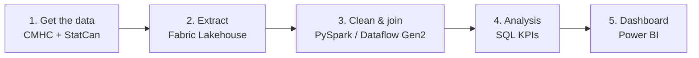

# GTA Housing Affordability

How affordable is renting in different Greater Toronto Area municipalities? This project compares **rent** (CMHC Rental Market Survey) against **household income** (Statistics Canada census) city by city (Brampton, Mississauga, Toronto, Oakville, Markham and more) instead of treating the GTA as one number. The final output is a Power BI dashboard.

> **Status:** 🚧 In progress. Currently at step 1 (getting the data). See the [schedule](#schedule).

---

## Why city level?

Most published numbers describe the **Toronto CMA** (the whole metro area) as a single figure, which hides the differences between cities. This project uses **census subdivision (CSD)** data, meaning one row per municipality, for both rent and income so the two can be joined and compared directly. Where a city-level number isn't available, a regional or provincial figure is used instead and clearly labelled as a stand-in.

## Data sources

| Dataset | Source | What we use | Geography |
|---|---|---|---|
| Rent | [CMHC Housing Market Information Portal](https://www03.cmhc-schl.gc.ca/hmip-pimh/) | Average rent by bedroom type (Rental Market Survey) | Census subdivision / CMHC zone |
| Income | [Statistics Canada](https://www12.statcan.gc.ca/census-recensement/), 2021 Census via the WDS API | Median household income | Census subdivision |

Full details, caveats and known gaps are in [DATA_SOURCES.md](Team-related-files/DATA_SOURCES.md). Step-by-step instructions for pulling the data are in [HOW_TO_GET_DATA.md](Team-related-files/HOW_TO_GET_DATA.md).

## Pipeline



| Step | Folder | Tools |
|---|---|---|
| 1. Get the data | [`1-Get the data/`](1-Get%20the%20data/) | CMHC portal, StatCan WDS API |
| 2. Extract: load both datasets into the Lakehouse as tables | [`2-Extract/`](2-Extract/) | Microsoft Fabric |
| 3. Clean & join on municipality | [`3-Clean/`](3-Clean/) | PySpark, Dataflow Gen2 |
| 4. Analysis: business questions and KPIs | [`4-Analysis/`](4-Analysis/) | SQL |
| 5. Dashboard | [`5-Power BI dashboard/`](5-Power%20BI%20dashboard/) | Power BI |

## Repository structure

```
gta-housing-affordability/
├── 1-Get the data/          # research notes and raw data pulls
├── 2-Extract/               # loading data into the Fabric Lakehouse
├── 3-Clean/                 # cleaning and joining rent + income
├── 4-Analysis/              # SQL queries and KPIs
├── 5-Power BI dashboard/    # dashboard files and screenshots
└── Team-related-files/
    ├── DATA_SOURCES.md      # data sources explained, caveats, known gaps
    ├── HOW_TO_GET_DATA.md   # how to pull each dataset
    ├── SCHEDULE_1.md        # timeline and owners
    └── Meeting Notes/       # meeting notes
```

## Schedule

| Step | Dates |
|---|---|
| Get the data | Sep 12–13 |
| Extract | Sep 13–14 |
| Clean & join | Sep 14–16 |
| SQL analysis | Sep 15–19 |
| Power BI dashboard | Sep 19–23 |
| Team review, polish, publish | Sep 24–28 |

Owners and details are in [SCHEDULE_1.md](Team-related-files/SCHEDULE_1.md).

## Things to keep in mind

- **Time gap:** income is from 2020 (2021 Census), while rent comes from the latest CMHC survey (2025). Rent-to-income ratios will look worse than today's reality.
- **Household, not individual:** a higher household income can simply mean larger households, not better-off people.
- **Purpose-built rentals only:** CMHC's survey doesn't cover condo rentals or basement suites, both common in the GTA.
- **Name matching:** CMHC and StatCan label places differently (e.g. "Brampton, City (CY)" vs "Brampton"). Joining on StatCan's Standard Geographical Classification (SGC) codes is more reliable than matching names.

## Team

Project lead: **Samriti**. Each member pushes their own findings to the relevant folder; the lead merges and makes the final call.
Title: **Samir**. <->.
Title: **Rebel**. <->.

## How to contribute

1. Put your work in the folder for its pipeline step.
2. Work on a branch and open a pull request rather than pushing straight to `main`.
3. Add meeting notes to `Team-related-files/Meeting Notes/`, kept short and in bullet points.
